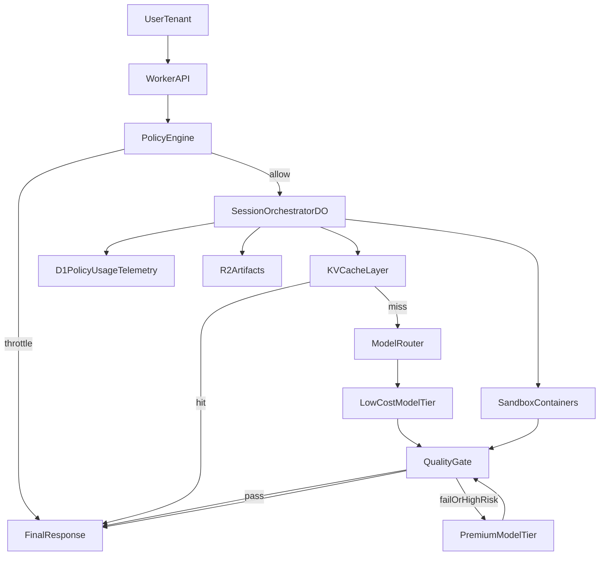

# Cost-Quality Multitenant Implementation Blueprint

## Objective

Implement a production-ready optimization layer for VibeSDK that maximizes output quality while minimizing credits and supporting concurrent multi-tenant usage.

Priorities:
1. Security and tenant isolation
2. Deterministic reliability
3. Cost efficiency
4. Quality under budget constraints

## Scope

This blueprint defines:
- A multitenant policy model
- A routing engine (cache -> low-cost -> premium escalation)
- Quality gates and bounded retry rules
- D1 schema for budget, usage, and routing telemetry
- Implementation pseudocode and rollout phases

Out of scope:
- Provider-specific prompt tuning details
- UI redesign
- Billing provider integration specifics

## Target Architecture



## Multitenant Policy Schema

Use one policy record per tenant (plan-derived defaults with optional tenant overrides).

```json
{
  "policyVersion": "1.0",
  "tenantPlan": "pro",
  "limits": {
    "hardMonthlyCredits": 1000000,
    "softMonthlyCredits": 850000,
    "maxConcurrentSessions": 8,
    "maxRequestsPerMinute": 120,
    "maxTokensPerMinute": 180000
  },
  "routing": {
    "defaultTier": "low_cost",
    "maxEscalationsPerRequest": 1,
    "allowPremiumForSecuritySensitive": true,
    "cacheTtlSeconds": 900
  },
  "quality": {
    "maxFixLoopsPerPhase": 2,
    "requireStaticChecksBeforePremium": true,
    "confidenceThreshold": 0.78
  },
  "degradation": {
    "enabledWhenSoftLimitReached": true,
    "disablePremiumAtHardLimit": true,
    "fallbackMode": "queue_or_partial"
  }
}
```

## Routing Decision Table

| Condition | Action | Tier | Notes |
|---|---|---|---|
| Cache hit (exact normalized key) | Return cached response | cache | Lowest cost path |
| Cache miss + low-risk operation | Run low-cost model | low_cost | Planning/scaffolding/simple edits |
| Low-cost output passes quality gate | Accept output | low_cost | No escalation |
| Low-cost output fails quality gate | Escalate once | premium | Strict escalation budget |
| Security-sensitive files touched | Direct premium allowed | premium | Auth, secrets, deploy, billing paths |
| Tenant soft limit exceeded | Degrade gracefully | low_cost_only | Disable premium unless policy exception |
| Tenant hard limit exceeded | Deny or queue | none | Preserve platform fairness |

## Quality Gate Contract

A response is accepted only if all required gates pass:

1. **Static gate**: lint/type/test subset (or deterministic syntax/AST checks)
2. **Runtime gate**: sandbox health and critical flow checks when applicable
3. **Policy gate**: security-sensitive path checks and invariant rules

If any required gate fails:
- Retry low-cost only if deterministic failure likely fixed quickly
- Else escalate to premium once
- Stop after max retry/escalation budget and return bounded failure with actionable guidance

## D1 Data Model (SQL)

```sql
-- Tenant budget and policy envelope
CREATE TABLE IF NOT EXISTS tenant_budgets (
  tenant_id TEXT PRIMARY KEY,
  plan TEXT NOT NULL,
  hard_monthly_credits INTEGER NOT NULL,
  soft_monthly_credits INTEGER NOT NULL,
  max_concurrent_sessions INTEGER NOT NULL,
  max_requests_per_minute INTEGER NOT NULL,
  max_tokens_per_minute INTEGER NOT NULL,
  policy_json TEXT NOT NULL,
  updated_at INTEGER NOT NULL
);

-- Raw usage events for cost accounting and throttling
CREATE TABLE IF NOT EXISTS usage_events (
  id TEXT PRIMARY KEY,
  tenant_id TEXT NOT NULL,
  session_id TEXT NOT NULL,
  request_id TEXT NOT NULL,
  provider TEXT NOT NULL,
  model TEXT NOT NULL,
  operation_type TEXT NOT NULL,
  input_tokens INTEGER NOT NULL DEFAULT 0,
  output_tokens INTEGER NOT NULL DEFAULT 0,
  credits_charged INTEGER NOT NULL DEFAULT 0,
  cache_hit INTEGER NOT NULL DEFAULT 0,
  created_at INTEGER NOT NULL
);

CREATE INDEX IF NOT EXISTS idx_usage_events_tenant_created
  ON usage_events (tenant_id, created_at);
CREATE INDEX IF NOT EXISTS idx_usage_events_request
  ON usage_events (request_id);

-- Quality outcomes (for adaptive routing and product KPIs)
CREATE TABLE IF NOT EXISTS quality_events (
  id TEXT PRIMARY KEY,
  tenant_id TEXT NOT NULL,
  request_id TEXT NOT NULL,
  gate_name TEXT NOT NULL,
  passed INTEGER NOT NULL,
  reason TEXT,
  created_at INTEGER NOT NULL
);

CREATE INDEX IF NOT EXISTS idx_quality_events_tenant_created
  ON quality_events (tenant_id, created_at);

-- Explainability and auditability of model selection
CREATE TABLE IF NOT EXISTS model_routing_decisions (
  id TEXT PRIMARY KEY,
  tenant_id TEXT NOT NULL,
  request_id TEXT NOT NULL,
  selected_tier TEXT NOT NULL,
  selected_provider TEXT,
  selected_model TEXT,
  escalation_trigger TEXT,
  confidence_score REAL,
  budget_state TEXT NOT NULL,
  created_at INTEGER NOT NULL
);

CREATE INDEX IF NOT EXISTS idx_routing_tenant_created
  ON model_routing_decisions (tenant_id, created_at);

-- Retry/fix loop analytics for controlling runaway cost
CREATE TABLE IF NOT EXISTS retry_outcomes (
  id TEXT PRIMARY KEY,
  tenant_id TEXT NOT NULL,
  request_id TEXT NOT NULL,
  phase_name TEXT NOT NULL,
  retry_count INTEGER NOT NULL,
  escalated_to_premium INTEGER NOT NULL DEFAULT 0,
  final_status TEXT NOT NULL,
  created_at INTEGER NOT NULL
);
```

## KV and Counter Key Design

- `policy:{tenantId}` -> serialized policy snapshot (short TTL + write-through from D1 updates)
- `cache:response:{tenantId}:{modelFamily}:{normalizedHash}` -> response payload + confidence + model metadata
- `quota_hint:rpm:{tenantId}:{minute}` -> soft request pressure hint
- `quota_hint:tpm:{tenantId}:{minute}` -> soft token pressure hint

Notes:
- Use deterministic normalization for hash keys to avoid cache misses from superficial prompt differences.
- Include model-family and critical tool context in cache key to prevent unsafe cross-context reuse.
- Hard quota enforcement and concurrency control should live in a Durable Object (or equivalent transactional control), not KV counters.

## Orchestrator Pseudocode

```ts
async function handleGenerationRequest(ctx: RequestContext): Promise<Response> {
  const policy = await getTenantPolicy(ctx.tenantId);
  // Hard guards should be atomically enforced in a per-tenant limiter DO.
  await enforceHardGuardsViaTenantLimiterDO(policy, ctx); // concurrent sessions, rpm, auth, hard budget

  const cacheKey = buildNormalizedCacheKey({
    tenantId: ctx.tenantId,
    modelFamily: getPlannedModelFamily(ctx),
    normalizedPrompt: normalizePrompt(ctx.prompt),
    toolContextHash: hashToolContext(ctx)
  });
  const cached = await kvGet(cacheKey);
  if (cached && isCacheUsable(cached, ctx)) {
    await recordUsage(ctx, { cacheHit: true, credits: 0 });
    return success(cached.payload, { source: 'cache' });
  }

  const budgetState = await getBudgetState(ctx.tenantId);
  const risk = classifyRisk(ctx); // low, medium, high_security_sensitive
  let tier = selectInitialTier(policy, budgetState, risk); // mostly low_cost

  let attempt = 0;
  let escalationUsed = false;
  while (attempt < policy.quality.maxFixLoopsPerPhase + 1) {
    const llmOutput = await runModelTier(tier, ctx);
    await recordUsage(ctx, llmOutput.usage);

    const qualityResult = await runQualityGates(ctx, llmOutput);
    await recordQuality(ctx, qualityResult);

    if (qualityResult.pass) {
      await kvSet(cacheKey, toCacheEntry(llmOutput), policy.routing.cacheTtlSeconds);
      await recordRouting(ctx, tier, budgetState, qualityResult.confidence);
      return success(llmOutput.payload, { source: tier });
    }

    // bounded escalation
    if (!escalationUsed && canEscalate(policy, budgetState, risk, qualityResult)) {
      tier = 'premium';
      escalationUsed = true;
      attempt++;
      continue;
    }

    // bounded retry in same tier (for deterministic recoverable failures only)
    if (isDeterministicRecoverable(qualityResult) && attempt < policy.quality.maxFixLoopsPerPhase) {
      attempt++;
      continue;
    }

    await recordRetryOutcome(ctx, attempt, escalationUsed, 'failed_quality_gate');
    return boundedFailure(qualityResult);
  }

  await recordRetryOutcome(ctx, attempt, escalationUsed, 'retry_budget_exhausted');
  return boundedFailure({ reason: 'retry_budget_exhausted' });
}
```

## Rollout Plan

### Phase 1: Guardrails and accounting
- Implement tenant policies and hard/soft budget checks.
- Add usage and routing telemetry tables.
- Enforce rate/concurrency limits.

### Phase 2: Cost reduction
- Add normalized prompt cache and cache-first execution.
- Introduce low-cost default routing and single premium escalation.

### Phase 3: Quality hardening
- Add deterministic quality gate pipeline with bounded retries.
- Add risk-based routing for security-sensitive operations.

### Phase 4: Adaptive optimization
- Use historical pass/fail and cost telemetry to tune thresholds per plan.
- Add provider-specific fallback and circuit-breaker strategies.

## SLOs and KPIs

Track these at tenant and global levels:
- Cost per successful generation
- Cache hit rate
- Premium escalation rate
- First-pass quality gate success
- Average retries per request
- p95 latency
- Hard-limit rejection rate

## Backward Compatibility and Safety

- Keep policy defaults permissive enough to avoid breaking current sessions.
- Gate new behavior with feature flags (`routing_v2_enabled`, `quality_gate_v1_enabled`).
- Preserve existing API contracts; add fields only as optional metadata.
- Never share cache entries across tenants without strict key scoping.

## Integration Points in Current Codebase

- Worker entry and routing: `worker/index.ts`
- Agent/session orchestration: `worker/agents/core/codingAgent.ts`
- AI proxy routing: `worker/services/aigateway-proxy/controller.ts`
- Sandbox execution: `worker/services/sandbox/`
- Database services/schema: `worker/database/`
- Existing architecture references: `docs/PROJECT_REVIEW.md`, `docs/architecture-diagrams.md`

---

This blueprint is implementation-ready and intentionally conservative on escalation/retry behavior to keep credit usage bounded while maintaining quality.
