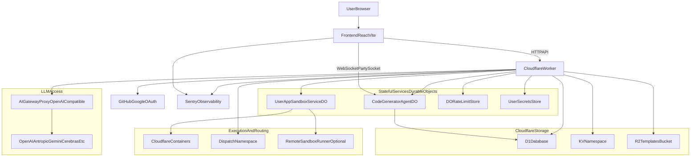
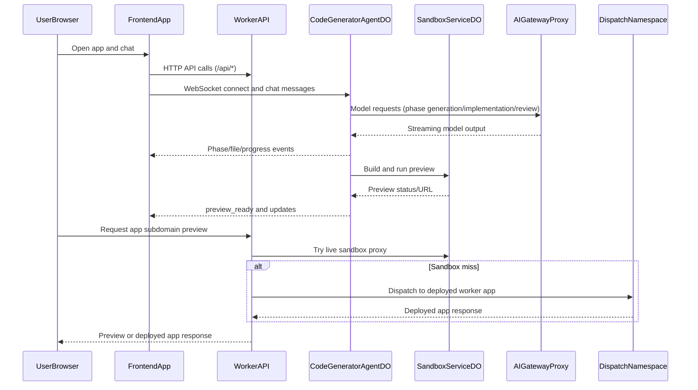

# VibeSDK Project Review

## Executive Summary

VibeSDK (also referenced as VibSDK in some existing docs) is an AI-powered full-stack app generation platform built primarily on Cloudflare infrastructure.
At runtime it combines a React frontend, a Cloudflare Worker backend, Durable Objects for per-session/stateful orchestration, D1/KV/R2 storage, Cloudflare Containers for sandbox execution, and an AI Gateway proxy for multi-provider model access.

Core references:
- [`README.md`](../README.md)
- [`wrangler.jsonc`](../wrangler.jsonc)
- [`worker/index.ts`](../worker/index.ts)
- [`docs/architecture-diagrams.md`](./architecture-diagrams.md)
- [`docs/setup.md`](./setup.md)

## Repository File Tree (Full-Depth, Pruned)

Excluded from this tree: `node_modules/`, `.git/`, build/cache artifacts (`dist/`, `.wrangler/`, `.vite/`, `.turbo/`, `coverage/`, `.cache/`), and OS metadata files.

```text
/mnt/d/ai-projects/vibesdk
├── .github/
├── .husky/
├── AGENTS.md
├── CHANGELOG.md
├── CLAUDE.md
├── LICENSE
├── README.md
├── SandboxDockerfile
├── bun.lock
├── commitlint.config.js
├── components.json
├── container/
│   ├── bun-sqlite.d.ts
│   ├── cli-tools.ts
│   ├── example-usage.sh
│   ├── monitor-cli.test.ts
│   ├── monitor-cli.test.ts.bak
│   ├── package.json
│   ├── process-monitor.ts
│   ├── storage.ts
│   ├── types.ts
│   └── packages-cache/
│       ├── bun.lock
│       └── package.json
├── debug-tools/
│   ├── ai_request_analyzer_v2.py
│   ├── conversation_analyzer.py
│   ├── extract_serialized_files.py
│   ├── migration_tester.py
│   ├── state_analyzer.py
│   ├── test-ai-gateway-analytics.ts
│   └── presentation-tester/
├── docs/
│   ├── architecture-diagrams.md
│   ├── llm.md
│   ├── POSTMAN_COLLECTION_README.md
│   ├── setup.md
│   ├── v1dev-api-collection.postman_collection.json
│   └── v1dev-environment.postman_environment.json
├── drizzle.config.local.ts
├── drizzle.config.remote.ts
├── eslint.config.js
├── index.html
├── knip.json
├── migrations/
│   ├── 0000_living_forge.sql
│   ├── 0001_married_moondragon.sql
│   ├── 0002_nebulous_fantastic_four.sql
│   ├── 0003_bumpy_albert_cleary.sql
│   ├── 0004_calm_omega_flight.sql
│   └── meta/
│       ├── _journal.json
│       ├── 0000_snapshot.json
│       ├── 0001_snapshot.json
│       ├── 0002_snapshot.json
│       ├── 0003_snapshot.json
│       └── 0004_snapshot.json
├── package.json
├── public/
│   └── vite.svg
├── samplePrompts.md
├── scripts/
│   ├── deploy.ts
│   ├── setup.ts
│   └── undeploy.ts
├── sdk/
│   ├── README.md
│   ├── bun.lock
│   ├── package.json
│   ├── tsconfig.json
│   ├── tsconfig.protocol.json
│   ├── scripts/
│   │   └── expand-drizzle-types.ts
│   ├── src/
│   │   ├── agentic.ts
│   │   ├── blueprint.ts
│   │   ├── client.ts
│   │   ├── emitter.ts
│   │   ├── http.ts
│   │   ├── index.ts
│   │   ├── ndjson.ts
│   │   ├── phasic.ts
│   │   ├── protocol.ts
│   │   ├── retry.ts
│   │   ├── session.ts
│   │   ├── state.ts
│   │   ├── types.ts
│   │   ├── utils.ts
│   │   ├── workspace.ts
│   │   └── ws.ts
│   └── test/
│       ├── README.test.md
│       ├── bun-test.d.ts
│       ├── client-build.test.ts
│       ├── fakes.ts
│       ├── http.test.ts
│       ├── ndjson.test.ts
│       ├── session-ws.test.ts
│       ├── state.test.ts
│       ├── test-server.ts
│       ├── workspace.test.ts
│       ├── ws-routing.test.ts
│       └── integration/
│           ├── integration.test.ts
│           ├── test-flow.ts
│           ├── worker.integration.test.ts
│           └── worker/
│               ├── bun.lock
│               ├── index.ts
│               ├── package.json
│               ├── tsconfig.json
│               └── wrangler.toml
├── shared/
│   └── types/
│       └── errors.ts
├── src/
│   ├── App.tsx
│   ├── api-types.ts
│   ├── index.css
│   ├── main.tsx
│   ├── routes.ts
│   ├── vite-env.d.ts
│   ├── components/
│   │   ├── shared/
│   │   │   ├── AppActionsDropdown.tsx
│   │   │   ├── AppCard.tsx
│   │   │   ├── AppFiltersForm.tsx
│   │   │   ├── AppListContainer.tsx
│   │   │   ├── AppSortTabs.tsx
│   │   │   ├── BaseHeaderActions.tsx
│   │   │   ├── ConfirmDeleteDialog.tsx
│   │   │   ├── GitCloneInline.tsx
│   │   │   ├── GitCloneModal.tsx
│   │   │   ├── ModelConfigInfo.tsx
│   │   │   ├── TimePeriodSelector.tsx
│   │   │   ├── VisibilityFilter.tsx
│   │   │   └── header-actions/
│   │   │       ├── HeaderButton.tsx
│   │   │       ├── HeaderDivider.tsx
│   │   │       ├── HeaderToggleButton.tsx
│   │   │       └── index.ts
│   │   ├── ui/...
│   │   └── vault/...
│   ├── contexts/...
│   ├── features/
│   │   ├── app/...
│   │   ├── core/...
│   │   ├── general/...
│   │   └── presentation/...
│   ├── hooks/...
│   ├── lib/...
│   ├── routes/
│   │   ├── app/index.tsx
│   │   ├── apps/index.tsx
│   │   ├── chat/
│   │   │   ├── chat.tsx
│   │   │   ├── components/...
│   │   │   ├── hooks/...
│   │   │   ├── mocks/...
│   │   │   └── utils/...
│   │   ├── discover/index.tsx
│   │   ├── home.tsx
│   │   ├── profile.tsx
│   │   ├── protected-route.tsx
│   │   └── settings/index.tsx
│   └── utils/...
├── test/
│   └── worker-entry.ts
├── tsconfig.app.json
├── tsconfig.json
├── tsconfig.node.json
├── tsconfig.tsbuildinfo
├── tsconfig.worker.json
├── vite.config.ts
├── vitest.config.ts
├── worker/
│   ├── app.ts
│   ├── index.ts
│   ├── api/
│   │   ├── websocketTypes.ts
│   │   ├── types/...
│   │   ├── controllers/...
│   │   ├── handlers/...
│   │   └── routes/...
│   ├── agents/...
│   ├── config/
│   ├── database/
│   │   ├── database.ts
│   │   ├── index.ts
│   │   ├── schema.ts
│   │   ├── types.ts
│   │   └── services/...
│   ├── logger/
│   ├── middleware/
│   │   ├── auth/...
│   │   └── security/...
│   ├── observability/
│   ├── services/
│   │   ├── aigateway-proxy/...
│   │   ├── analytics/...
│   │   ├── cache/...
│   │   ├── code-fixer/...
│   │   ├── csrf/...
│   │   ├── deployer/...
│   │   ├── github/...
│   │   ├── oauth/...
│   │   ├── rate-limit/...
│   │   ├── sandbox/...
│   │   ├── secrets/...
│   │   └── static-analysis/...
│   ├── types/
│   └── utils/
├── worker-configuration.d.ts
├── wrangler.jsonc
└── wrangler.test.jsonc
```

## Key Directories and Responsibilities

- [`src/`](../src): React frontend (routes, chat UX, shared UI components, client-side API calls, Sentry init).
- [`worker/`](../worker): Cloudflare Worker backend (Hono routing, agent orchestration, services, integrations).
- [`sdk/`](../sdk): TypeScript SDK package for client/session/protocol interactions with VibeSDK.
- [`shared/`](../shared): Shared cross-runtime types used by frontend/backend.
- [`migrations/`](../migrations): D1/SQLite schema migrations and migration snapshots.
- [`container/`](../container): Sandbox container helpers and process/runtime monitoring utilities.
- [`docs/`](./): Setup, architecture, and API documentation.

## System Architecture

### High-Level Context



### Chat Session and Preview Flow



## Tools and Services Inventory (with Code Pointers)

- **Cloudflare Worker runtime + routes**: [`worker/index.ts`](../worker/index.ts), [`wrangler.jsonc`](../wrangler.jsonc)
- **Durable Objects**:
  - `CodeGeneratorAgent`: [`worker/agents/core/codingAgent.ts`](../worker/agents/core/codingAgent.ts)
  - `UserAppSandboxService`: [`worker/services/sandbox/sandboxSdkClient.ts`](../worker/services/sandbox/sandboxSdkClient.ts)
  - `DORateLimitStore`: [`worker/services/rate-limit/DORateLimitStore.ts`](../worker/services/rate-limit/DORateLimitStore.ts)
  - `UserSecretsStore`: [`worker/services/secrets/UserSecretsStore.ts`](../worker/services/secrets/UserSecretsStore.ts)
- **Storage**:
  - D1 bindings and migrations: [`wrangler.jsonc`](../wrangler.jsonc), [`migrations/`](../migrations)
  - Drizzle schema/services: [`worker/database/schema.ts`](../worker/database/schema.ts), [`worker/database/database.ts`](../worker/database/database.ts)
  - KV/R2 bindings: [`wrangler.jsonc`](../wrangler.jsonc)
- **Sandbox and execution**:
  - Cloudflare Containers config: [`wrangler.jsonc`](../wrangler.jsonc), [`SandboxDockerfile`](../SandboxDockerfile)
  - Sandbox request proxy: [`worker/services/sandbox/request-handler.ts`](../worker/services/sandbox/request-handler.ts)
  - Optional remote runner client: [`worker/services/sandbox/remoteSandboxService.ts`](../worker/services/sandbox/remoteSandboxService.ts)
- **Workers for Platforms dispatch namespace**: [`wrangler.jsonc`](../wrangler.jsonc), [`worker/index.ts`](../worker/index.ts)
- **AI Gateway / model proxying**: [`worker/services/aigateway-proxy/controller.ts`](../worker/services/aigateway-proxy/controller.ts), model config in [`worker/agents/inferutils/config.ts`](../worker/agents/inferutils/config.ts)
- **WebSocket real-time messaging**: server protocol [`worker/api/websocketTypes.ts`](../worker/api/websocketTypes.ts), client handling [`src/routes/chat/utils/handle-websocket-message.ts`](../src/routes/chat/utils/handle-websocket-message.ts)
- **OAuth and external integrations**:
  - GitHub OAuth: [`worker/services/oauth/github.ts`](../worker/services/oauth/github.ts)
  - Google OAuth: [`worker/services/oauth/google.ts`](../worker/services/oauth/google.ts)
  - GitHub export/integration: [`worker/services/github/GitHubService.ts`](../worker/services/github/GitHubService.ts)
- **Observability**:
  - Worker Sentry: [`worker/observability/sentry.ts`](../worker/observability/sentry.ts)
  - Frontend Sentry: [`src/utils/sentry.ts`](../src/utils/sentry.ts)
  - Wrangler observability flags: [`wrangler.jsonc`](../wrangler.jsonc)

## Operational Notes

- Local/dev and production setup flow is documented in [`docs/setup.md`](./setup.md).
- Developer commands are documented in [`AGENTS.md`](../AGENTS.md).
- Deeper, broader diagram set is available in [`docs/architecture-diagrams.md`](./architecture-diagrams.md).
